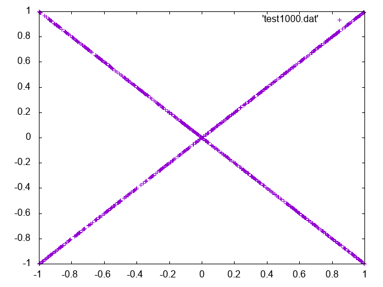

# Deep Learning 第3章 共分散の図

## 動作環境
- C++11 が使えればOK
- 画像を生成したければgnuplotとか

## 使い方
コンパイルして実行(無引数)  
標準出力をリダイレクトしてファイルに保存するなりして画像を生成  
最後の3行にx,yの平均値と共分散を出力  

## 例
  
E[x] = 0.0264101  
E[y] = 0.0103111  
Cov(x,y) = -0.00349902
